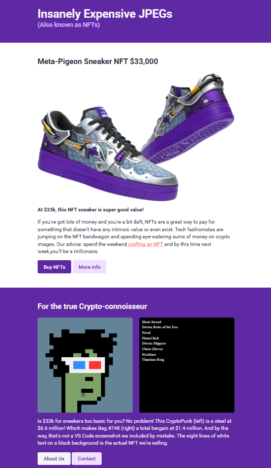

# An-NFT-Site 🖼️💎

A simple landing page that satirically showcases **high-priced NFTs**, built to practice **semantic HTML**, **CSS layout**, and **modern styling techniques**.

---

## 📸 Screenshot



---

## 📖 About the Project

**An-NFT-Site** is a static landing page that humorously presents fictional NFT products with exaggerated pricing.  
The project focuses on clean HTML structure, reusable CSS classes, typography, and layout consistency.

It was built as a **frontend practice project** to strengthen core web development fundamentals.

---

## ✨ Features

- Semantic HTML structure (`header`, `main`, `section`, `footer`)
- Clean and readable layout
- Reusable button components with hover states
- Google Fonts integration (Roboto)
- Image-based content sections
- Clear call-to-action buttons
- Simple and consistent color theme

---

## 🛠️ Built With

- **HTML5** – Semantic markup and page structure
- **CSS3** – Layout, typography, and styling
- **Flexbox** – Image alignment in content sections
- **Google Fonts** – Roboto font family

---

## 🎯 What I Practiced

- Semantic HTML for accessibility and structure
- Typography styling (font sizes, line-height, font weights)
- Reusable CSS utility classes (`.btn`, `.btn-dark`, `.btn-light`)
- Flexbox layout for image alignment
- Centered layouts using max-width and margins
- Hover and active states for links and buttons
- Consistent spacing and padding across sections

---

## 🚀 How to Run Locally

1. Clone the repository:
   ```bash
   git clone https://github.com/goldenokeama/NFT-site.git
   ```
2. Navigate into the project folder.

3. Open index.html in your browser.

No additional setup required.
